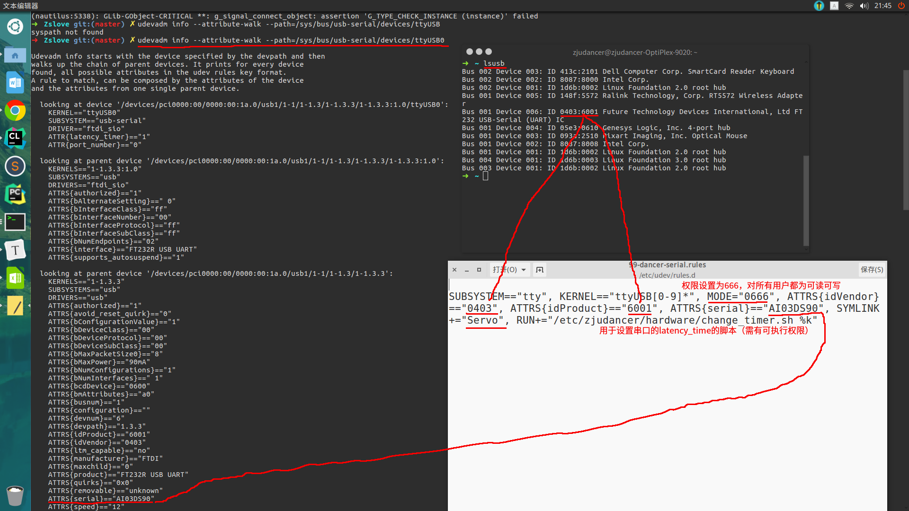

# NewIO
New version of IO for dancing cock
## Pre-Requirement 
+ ROS is a must for IOManager and the other part.**BUT** ist not necessary ServoIO, which means you can make some change of the files then use cmake instead to build files.
+ but ROS is suggested 

## How to build 
+ This is a ROS workspace use the following code to build
 ``` cpp
  catkin_make
  source devel/setup.zsh
 ```

## Serial ports config

We use udev rules to change the access permissions to devices, set port corresponded to our port names used in code.

Generally, the serial port mapping are listed below:

- ttyUSB0---> Servo
- ttyUSB1---> IMU

For instant setup for usage, you can put the [99-dancer-serial.rules](./udev/99-dancer-serial.rules) to `/etc/udev/rules.d`, and put the [change_timer.sh](./udev/change_timer.sh) to `etc/zjudancer/hardware`, then give executive permission to this file: `sudo chmod +x change_timer.sh` .

If one day  the hardware is changed, you should learn to change the rules according to new features, hope you can get some suggestion from the below figure.




## Tips

+ All IO is finished 
+ Read the description function of the code in  
  + src/dmotion/include/dmotion/IO/SeroIO.h  
  + src/dmotion/include/dmotion/IO/IOManager.h
  + src/dmotion/include/dmotion/IO/FeetSensorIO.h
  + src/dmotion/include/dmotion/IO/IMUReader.h
+ example show how to use servo and iomanager and the sensors to read and write Servo 
+ if it's the first time that you used this code, make sure you have checked the Macro definition in the following files is correct(especially the port and baud rate)
  + src/dmotion/src/IO/SeroIO.cpp
  + src/dmotion/src/IO/IOManager.cpp
  + src/dmotion/src/IO/FeetSensorIO.cpp
  + src/dmotion/src/IO/IMUReader.cpp
+ **In the issue some solutions of some tricky bugs is recorded.**

## What's new
+ you can find it yourself

## Run a test 
+ There are some examples that you can use roslaunch to test
 ``` sh
  roslaunch dmotion ...    #servo_read.launch or servo_write.launch or IOManager_read_write.launch
 ```
+ make sure you have the authority of the USB port,use the following code in terminal to get authority
```sh
 sudo chmod 666 /dev/ttyUSB0     #sometimes it's not USB0
```
